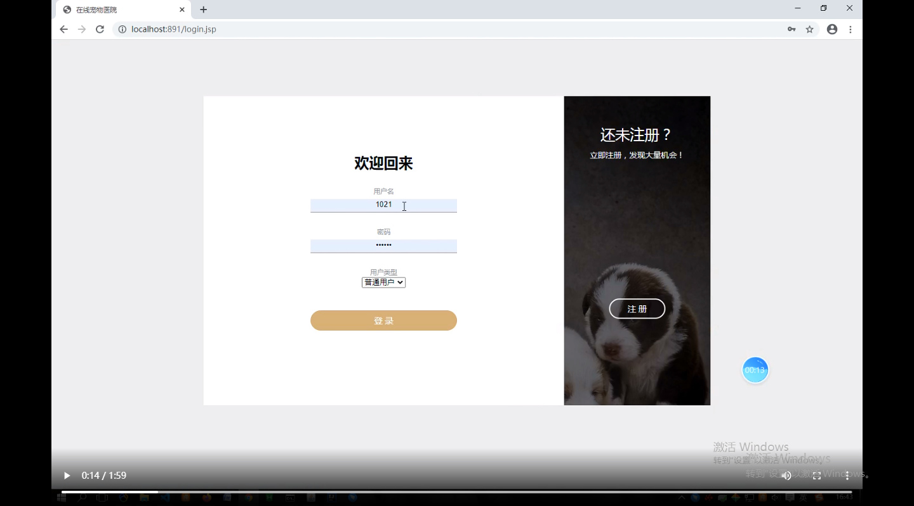
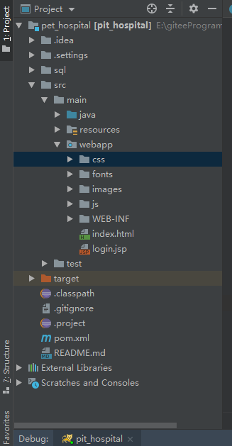
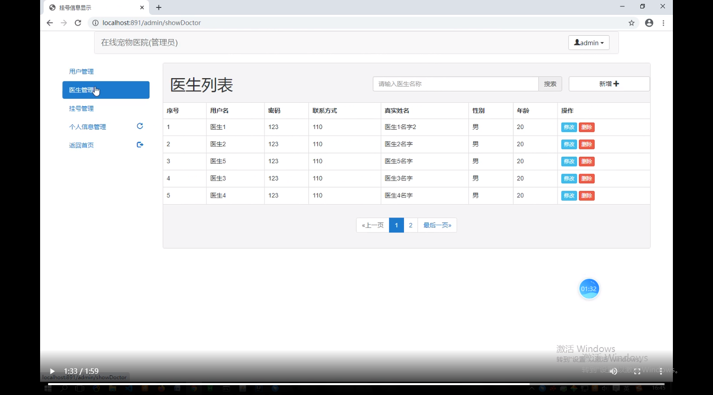
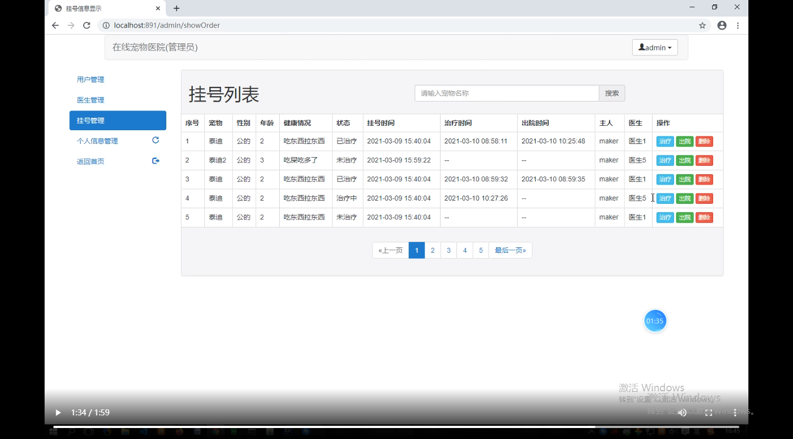
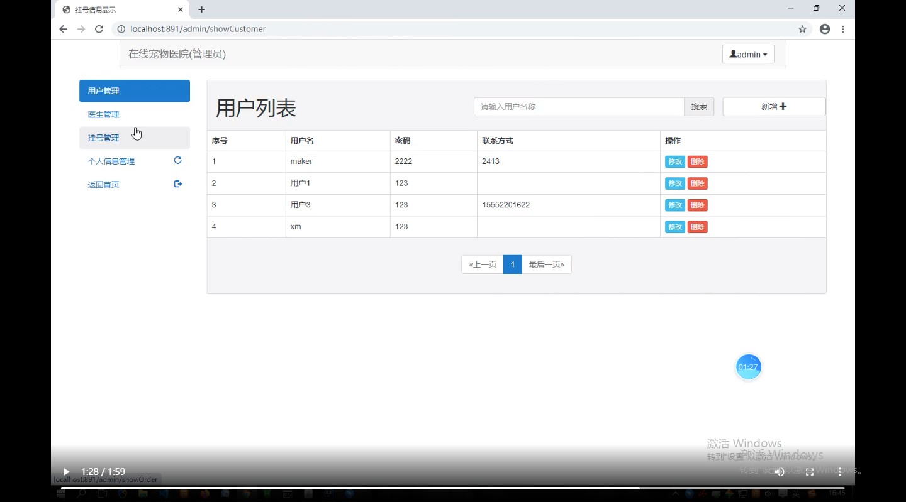
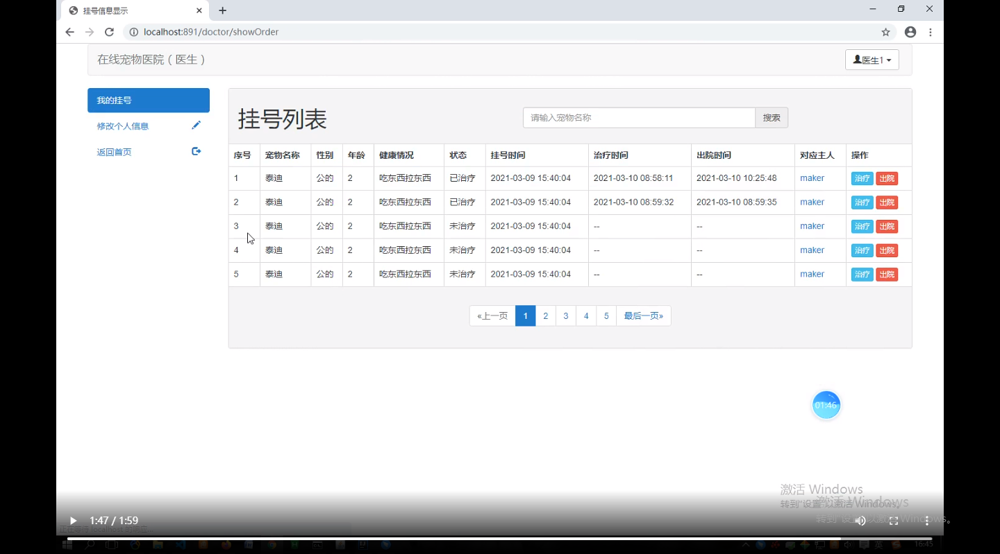
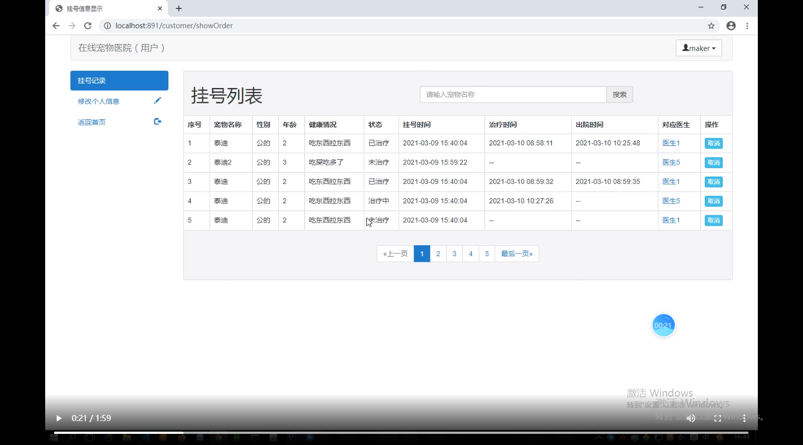
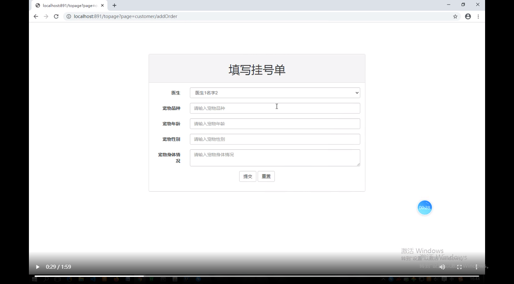

本项目是基于ssm的在线宠物医院管理系统

项目代码已收录公众号【java项目源码】，需要请自行关注一下公众号并下载源码

所用技术：ssm框架+bootstrap框架

开发工具：idea/eclipse+maven+tomcat

主要功能：

本系统分为三个用户：

注册登录、密码修改、切换退出账号

医生部分：
（1） 管理个人信息
（2） 查看宠物主人信息
（3） 处理医疗订单
（4） 查看自己所诊治的宠物详细信息以及更新宠物状态信息

用户部分：
（1）查看宠物的治疗情况和宠物的主治医师信息
（2）管理个人信息
（3）网上帮宠物挂号

管理员部分：
（1） 管理用户信息，包括普通用户和管理员用户
（2） 查看客户信息，处理用户的订单
（3） 查看宠物信息，更新宠物状态
（4） 查看医生信息，更新医生状态

运行视频地址：[基于ssm的在线宠物医院管理系统](https://www.bilibili.com/video/BV1sA411N7hL/)

管理员：

医生：

用户：

